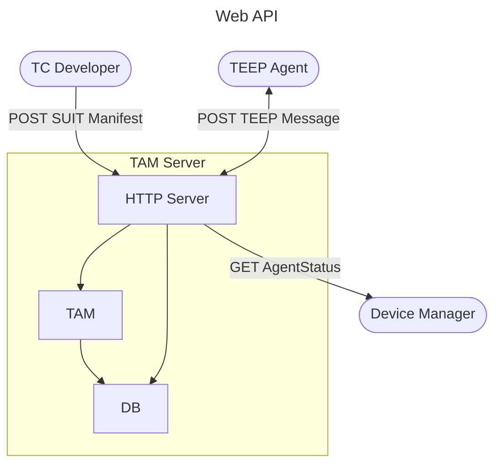

## TAM's External Design

Method | Endpoint | Requester | Input | Output | Reference
--|--|--|--|--|--
POST | `/tam` | TEEP Agent | empty QueryResponse Success Error | 200: QueryRequest 200: Update / QueryResponse 204: empty 204: empty | [TEEP_MESSAGE_HANDLE](TEEP_MESSAGE_HANDLE.md)
POST | `/api/addManigest` | TC Developer | SUIT Manifest | 200: OK
GET | `/api/getAgents` | Device Manager | `{TBD}` | 200: `{TBD}`
