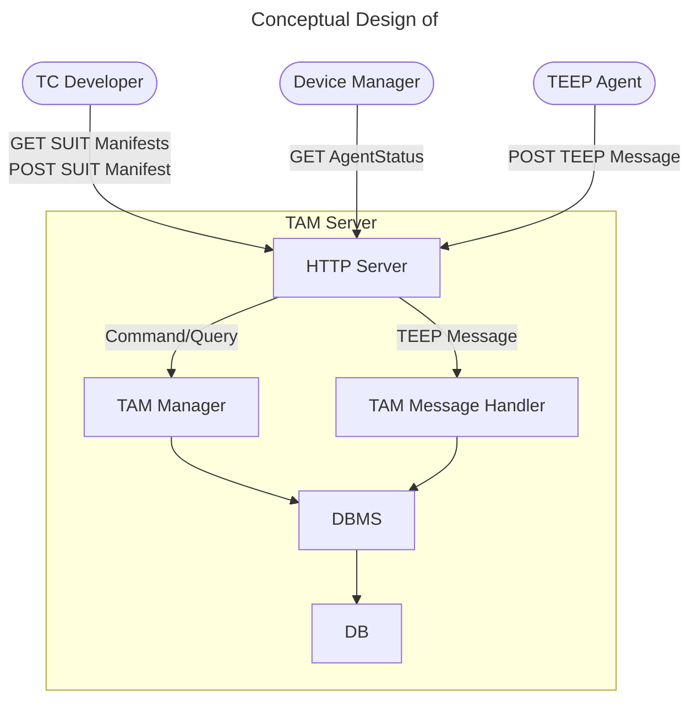

## TAM's External Design

Method | Endpoint | Requester | Input | Output | Reference
--|--|--|--|--|--
GET | `/tc-developer/getManifests` | TC Developer | `{TBD}` | 200: `[overview of SUIT Manifest]`
POST | `/tc-developer/addManifest` | TC Developer | SUIT Manifest | 200: OK
GET | `/dev-admin/getAgents` | Device Manager Admin | `{TBD}` | 200: `{TBD}` (status of Agents owned by the Device Manager Admin)
POST | `/tam` | TEEP Agent | empty QueryResponse Success Error | 200: QueryRequest 200: Update / QueryRequest 204: empty 204: empty | [TEEP_MESSAGE_HANDLE](TEEP_MESSAGE_HANDLE.md)
