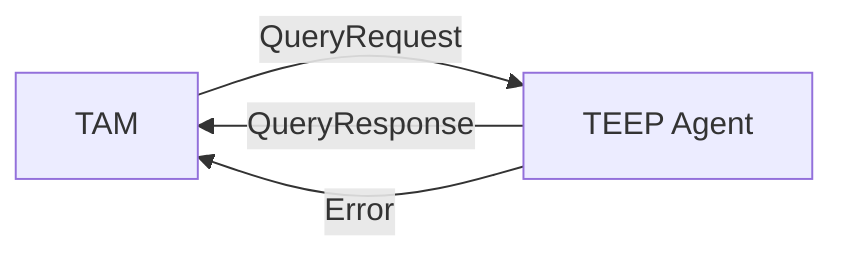
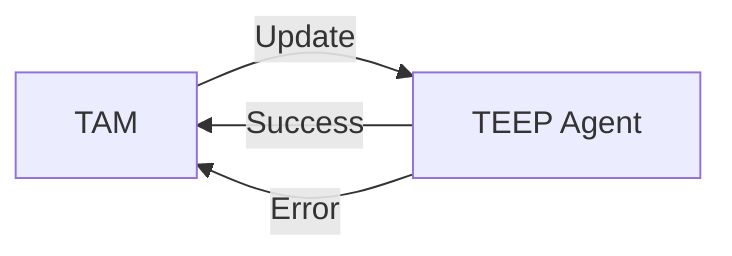
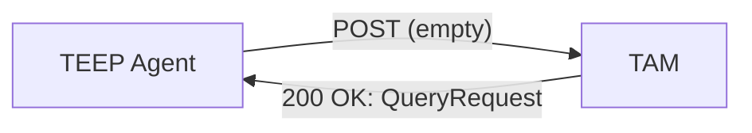
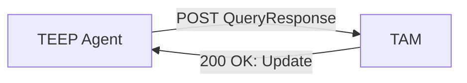
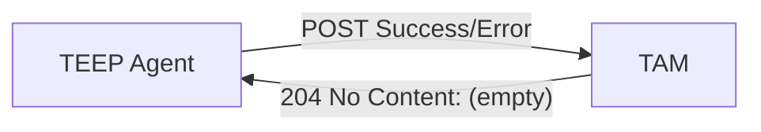
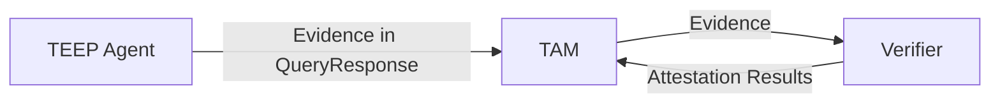
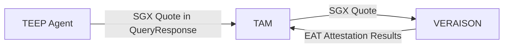
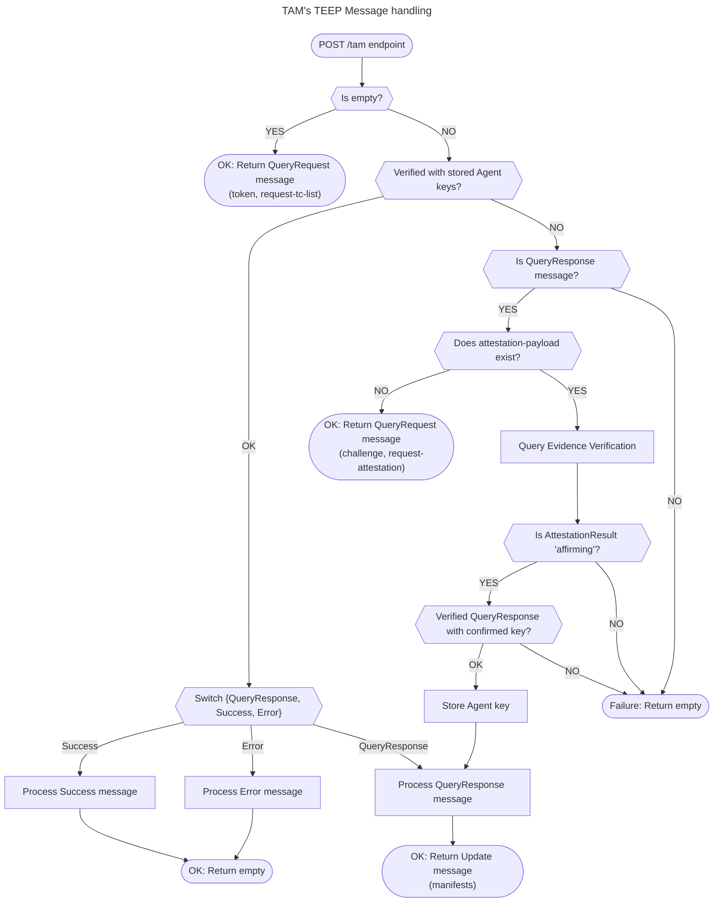

## TAM's TEEP Message handling

### TEEP Protocol interactions defined in (Draft) RFCs

The [section 3 of TEEP Protocol](https://datatracker.ietf.org/doc/html/draft-ietf-teep-protocol-21#section-3) defines how TEEP Agents to reply messages from TAM:

However, in some cases the TAM cannot initiate sending the messages, for example,
the TEEP Agent (or the TEEP Broker) does not provide listening sockets,
the TAM cannot reach the TEEP Agent due to NAT traversal issues, etc.

[TEEP over HTTP](https://datatracker.ietf.org/doc/draft-ietf-teep-otrp-over-http) resolves such situations the TAM providing HTTP server to accepts messages from TEEP Agents:

### TEEP with Remote Attestation

For the TAM to securely manage the Trusted Components inside TEEs, our TAM implementation requires Remote Attestation of TEEP Agents.
The TAM wamts to confirm following points:
1. the TEEP Agent is running inside a genuine TEE
2. the TEE softwares including TEEP Agents keep integrity and authentication
3. the signing key of TEEP Agent's was securely generated inside the TEE

To achieve these requirements,
the TEEP Agent requests the Attesting Environment (e.g. Intel SGX Quoting Enclave) to generate Evidence (e.g. SGX Quote) and sends it in QueryResponse message,
and the TAM requests the Verifier to verify it.

> [!NOTE]
> The above chart is based on background-check model

In our implementation, we use customized [VERAISON](https://github.com/kentakayama/services) (the original one is under the [VERAISON project repository](https://github.com/veraison)) for Verifier to verify the SGX Quote.

Our customized VERAISON verifies that:
1. the SGX Quote has been generated by the authorized Quoting Enclave under the certificate chain from Intel Certificate Authority (CA)
2. MRENCLAVE and MRSIGNER are expected values respectively
3. the TEEP Agent bound to the MRENCLAVE is programmed generating its signing key inside TEE

While SGX Quote is defined by the products, our customized VERAISON produces Attestation Results in [IETF RATS EAT](https://datatracker.ietf.org/doc/rfc9711) format based on the [EAT Profile of TEEP Protocol](https://datatracker.ietf.org/doc/html/draft-ietf-teep-protocol#section-5).
We leverages the [Key Confirmation Claim of CWT](https://datatracker.ietf.org/doc/rfc8747/): the VERAISON extracts the TEEP Agent's key from SGX Quote Report Data and stores it inside [EAT Attestation Results](https://datatracker.ietf.org/doc/draft-ietf-rats-ear/).

TODO: SGX Quote constraction and Report Data => EAT Attestation Results conversion (external link to our customized VERAISON)

### How this TAM implementation Acts

Based on these (draft) RFCs, we implemented this TAM over HTTP as following:

